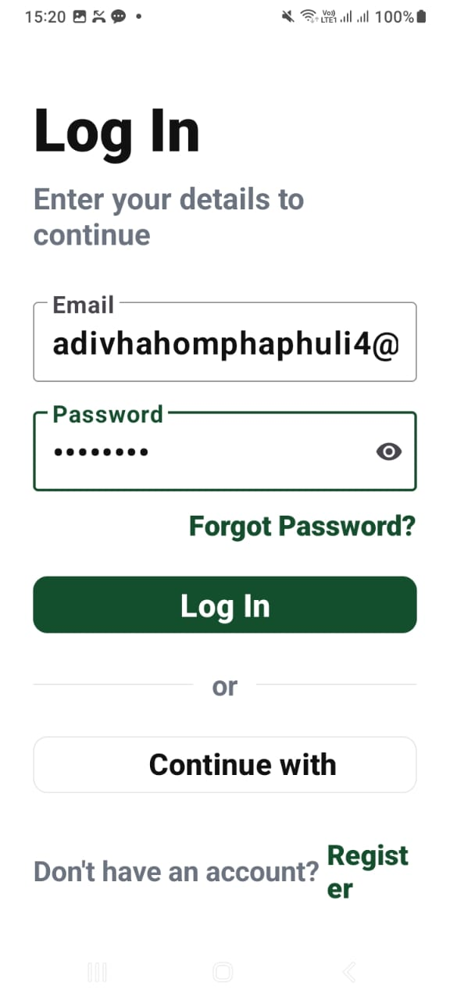
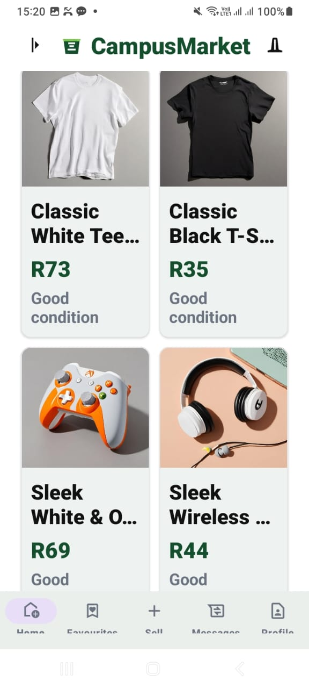
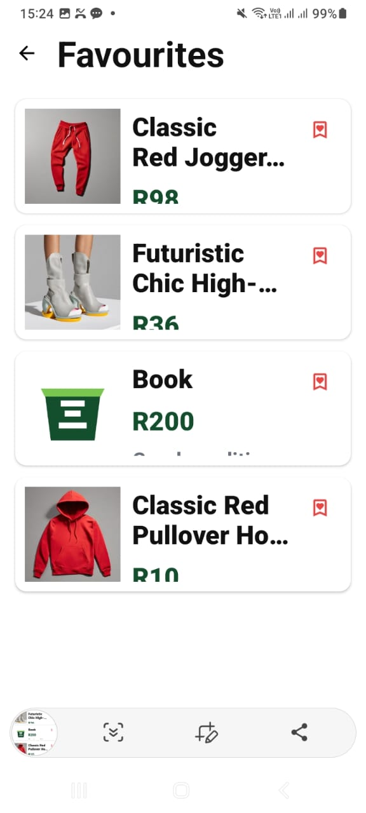

# CampusMarket

CampusMarket is a native Android student marketplace written in Kotlin. Students can register, sign in, browse and filter products, publish or draft listings, save favourites, manage their profile, and message sellers.

## Features

- Firebase email/password authentication, password reset, and Google Sign-In flow
- Editable Firebase Auth profile and secure password change with re-authentication
- Product search and category filtering
- Persistent Firestore favourites
- Active and draft listings stored in Firestore with a placeholder image
- Firestore conversations and chat messages
- Notification and dark-mode preferences stored with DataStore
- Firestore security rules
- JUnit tests and GitHub Actions build/test workflow

## Application Screenshots

### Login



### Home Marketplace



### Favourites



### Messages


### Automated Unit Tests


### GitHub Actions


## Requirements

- Android Studio with JDK 17
- Android SDK 36 (minimum supported device: Android 7.0 / API 24)
- A Firebase project with Authentication and Firestore enabled

## Firebase setup

1. Open the project in Android Studio and let Gradle sync.
2. In Firebase Authentication, enable **Email/Password** and **Google** providers.
3. Run `./gradlew signingReport` (or the Gradle `signingReport` task in Android Studio).
4. Add the debug SHA-1 and SHA-256 fingerprints to the Android app in Firebase Project Settings.
5. Download the refreshed `google-services.json` and replace `app/google-services.json`.
6. Deploy the included rules with `firebase deploy --only firestore:rules` or paste them into the Firestore console.

The configuration supplied with the original project has an empty `oauth_client` list. Google Sign-In cannot return an ID token until steps 2–5 are completed. Email/password authentication works independently.

## Build and test

On Windows:

```powershell
.\gradlew.bat testDebugUnitTest assembleDebug
```

On macOS/Linux:

```bash
./gradlew testDebugUnitTest assembleDebug
```

The debug APK is created at `app/build/outputs/apk/debug/app-debug.apk`. Unit-test reports are under `app/build/reports/tests/testDebugUnitTest/`.

## Firebase data model

| Collection | Purpose |
| --- | --- |
| `users` | User display name and email |
| `listings` | Active, sold, and draft marketplace listings; images use the built-in placeholder on the Spark plan |
| `favourites` | Persistent user-to-product favourites |
| `conversations` | Two-user conversation metadata |
| `messages` | Individual chat messages |

##Video demonstration link 
https://youtu.be/WZzDPLUCt5k  


Sample API catalogue products do not have CampusMarket seller accounts, so messaging is deliberately enabled only for student-created Firestore listings.

## Known external dependency

The home catalogue uses the EscuelaJS/Platzi products API. An internet connection is required to load its sample products. User-created listings, favourites, and messages use Firebase.
